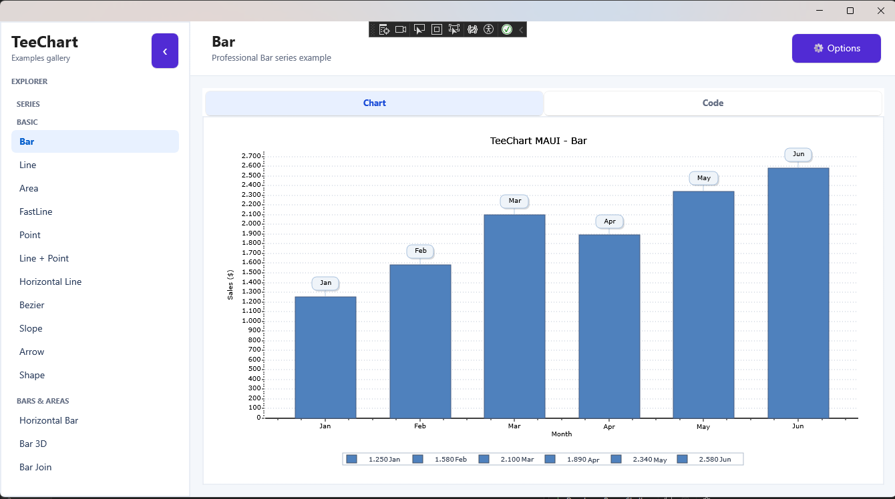
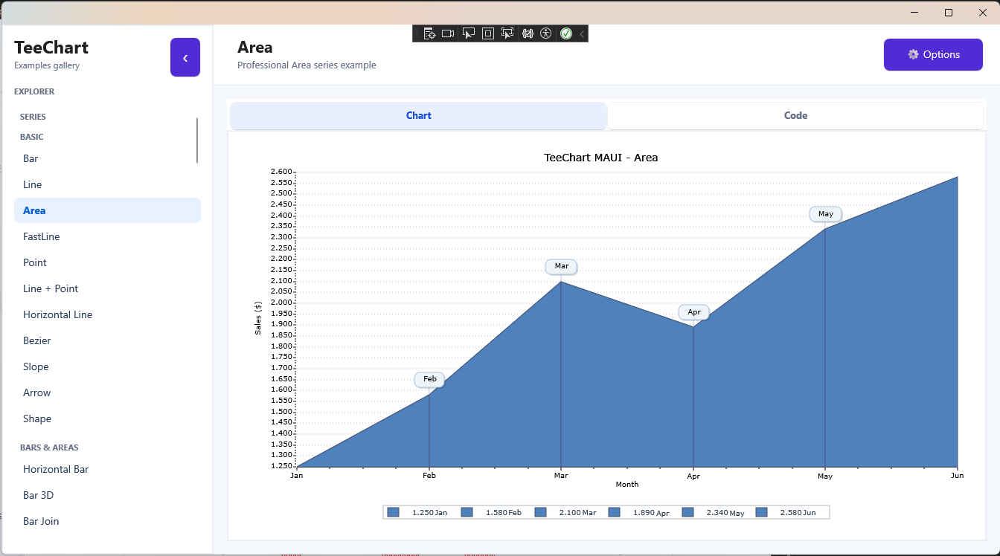
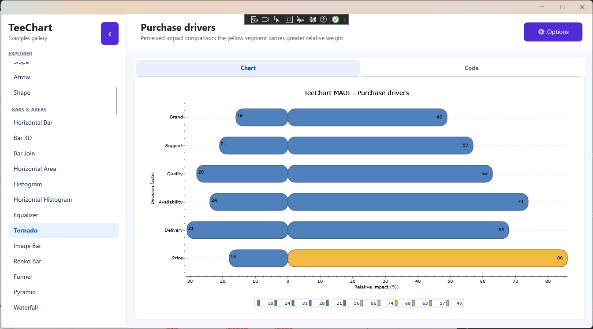
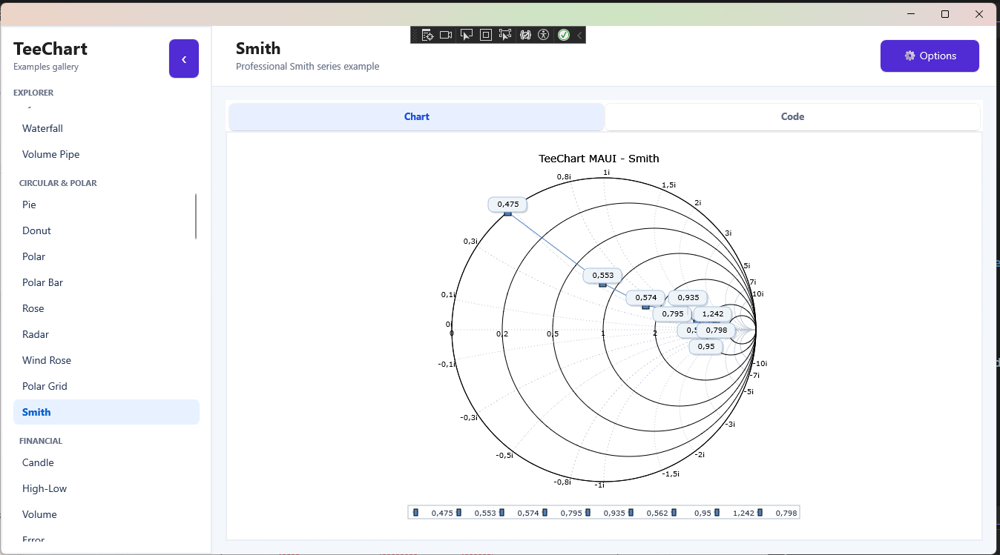
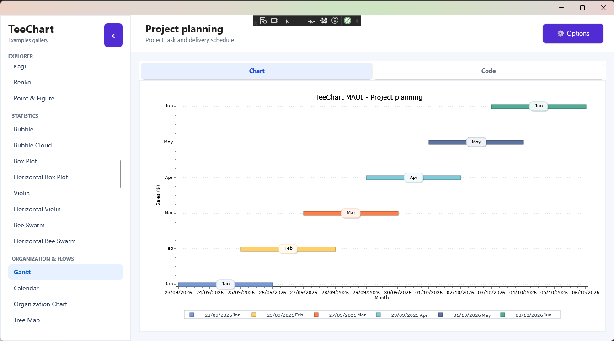
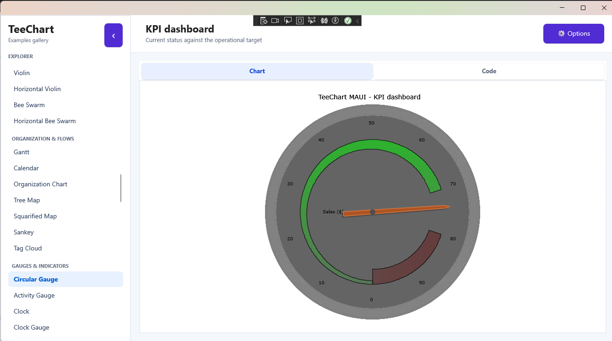

# TeeChart for .NET MAUI
## Interactive demo gallery for .NET 10 MAUI

`TeeChart.Maui.TEST` is an interactive gallery of TeeChart examples for .NET 10 MAUI. The application presents chart series and chart tools in a navigable explorer so the same demo can be used across Android, iOS, Mac Catalyst and Windows targets.

Each example includes a **Chart** tab and a **Code** tab. The chart tab renders the selected series with realistic sample data, while the code tab shows the essential TeeChart configuration used to create it. The **Options** panel exposes common chart properties such as 3D view, marks, legend, zoom and font size.

The demo includes:

- Basic series such as Bar, Line, Area, FastLine, Point, Bezier, Slope and Shape
- Bar and area series such as Histogram, Tornado, Funnel, Pyramid, Waterfall and Renko Bar
- Circular and polar series such as Pie, Donut, Radar, Rose, Wind Rose and Smith
- Financial series such as Candle, High-Low, Volume, Kagi, Renko and Point & Figure
- Statistical series such as Bubble, Box Plot, Violin and Bee Swarm
- Organization and flow charts such as Gantt, Calendar, Tree Map, Sankey and Tag Cloud
- Gauges and indicators such as Circular Gauge, Activity Gauge, Clock Gauge and Multiple Gauges
- 3D, surface and map series such as Surface, Contour, Color Grid, Tower, World Map and Image Point
- Interactive tools for annotations, axes, cursors, selection, data tables, legends, scrolling, hotspots and chart export

The data is generated locally for demonstration purposes. It is intended to show how TeeChart series, axes, marks, legends, gauges, 3D views and tools can be configured from a shared MAUI page.

## Demo gallery

The following captures show several of the visualizations available in the MAUI gallery:

### Bar

The bar example compares monthly sales values and demonstrates category labels, marks, axes and a bottom legend.

### Area

The area example displays the evolution of monthly sales as a filled series while retaining the same chart navigation and code view.

### Purchase drivers

The tornado chart compares the perceived impact of purchase drivers around a central baseline. The highlighted price segment shows how individual visual emphasis can be applied to a series.

### Smith

The Smith chart presents normalized measurements in a polar coordinate system, with value marks arranged around the chart grid.

### Project planning

The Gantt example shows project tasks distributed across a date axis and demonstrates how TeeChart can be used for schedule and delivery views.

### KPI dashboard

The circular gauge example displays a current operational value against a 0–100 scale, including ticks, labels, a hand and a colored status ring.

## References

For more information visit [https://www.steema.com/product/net](https://www.steema.com/product/net)

### Nuget package

[Nuget: https://www.nuget.org/packages/Steema.TeeChart.NET/](https://www.nuget.org/packages/Steema.TeeChart.NET/)

## Steema Software SL

[https://www.steema.com/](https://www.steema.com/) - info@steema.com
