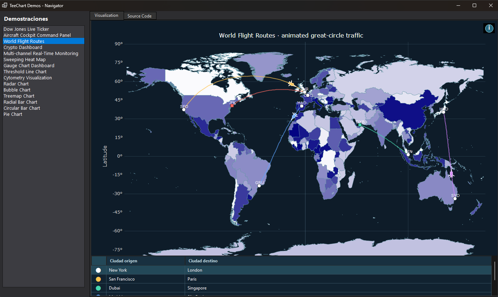
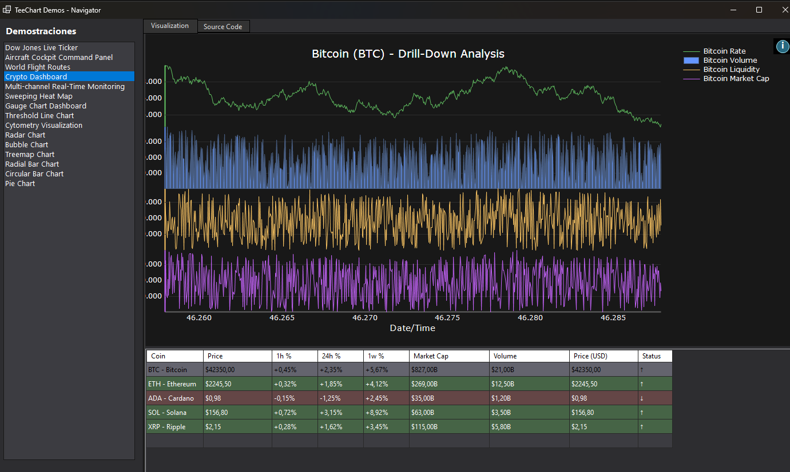
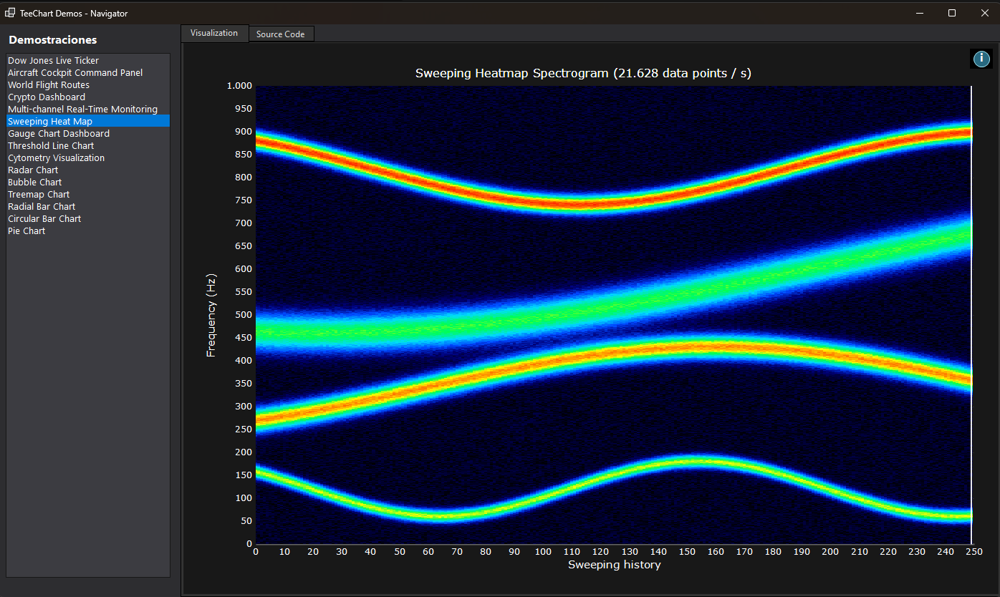
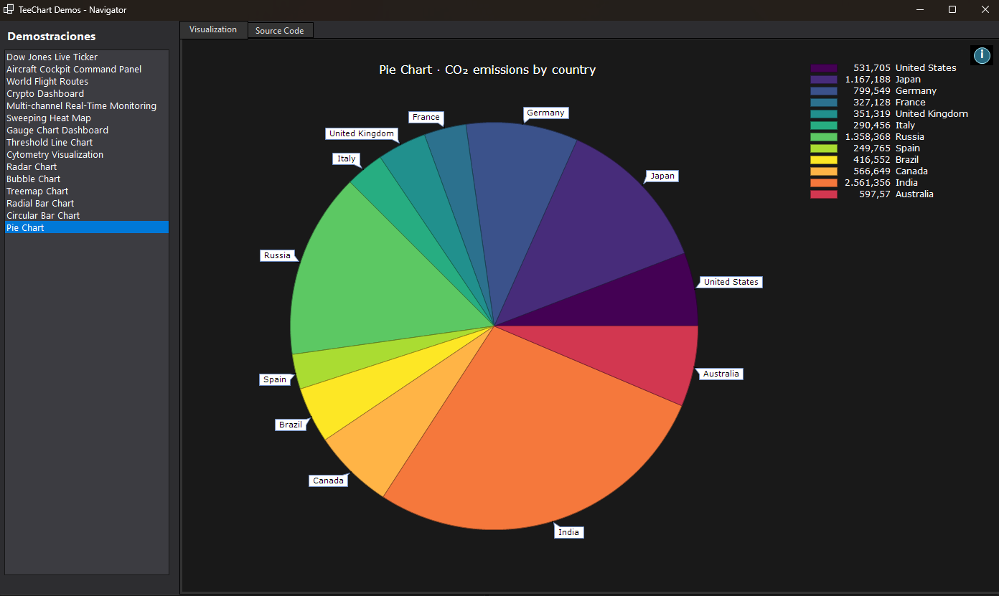
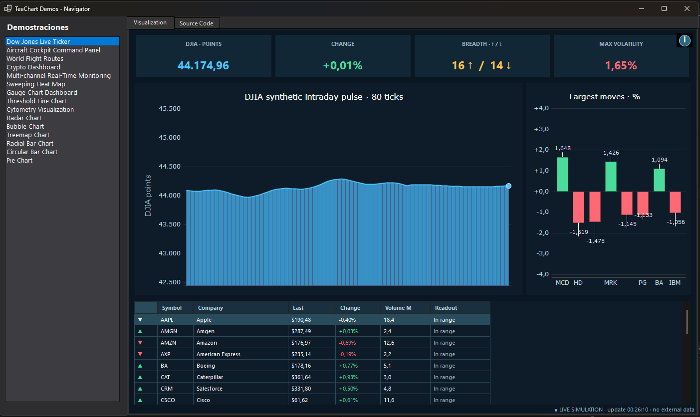
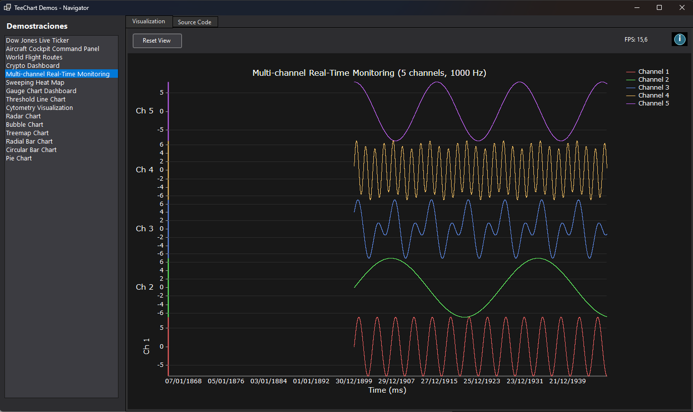

# TeeChart for .NET Pro
## Interactive demo dashboard for .NET 10 WinForms

`NewTeeChartNETDemos` is a collection of interactive TeeChart examples for .NET 10 Windows Forms. The navigator brings together real-time dashboards, animated data visualizations, maps, financial indicators and chart-focused examples in a single demo application.

Each example includes a **Visualization** tab and a **Source Code** tab so the chart configuration can be explored alongside the rendered result. The data is simulated locally and is intended to demonstrate TeeChart series, axes, animation and dashboard layout techniques.

The demo includes:

- Dow Jones Live Ticker
- Aircraft Cockpit Command Panel
- World Flight Routes
- Crypto Dashboard
- Multi-channel Real-Time Monitoring
- Sweeping Heat Map
- Gauge Chart Dashboard
- Threshold Line Chart
- Cytometry Visualization
- Radar Chart
- Bubble Chart
- Treemap Chart
- Radial Bar Chart
- Circular Bar Chart
- Pie Chart

## Demo gallery

The following captures show several of the visualizations available in the dashboard:

### World Flight Routes

Animated great-circle routes connect airports on a world map. The route table below the chart shows the origin and destination for each flight.

### Crypto Dashboard

The crypto dashboard combines a drill-down chart with a data table. Selecting a coin updates the rate, volume, liquidity and market-cap series.

### Sweeping Heat Map

The sweeping heat map simulates a live frequency display with several moving signal bands.

### Pie Chart

The pie chart example presents a country comparison with point labels and a matching legend.

### Dow Jones Live Ticker

The Dow Jones Live Ticker simulates an intraday market monitor with animated index values, market breadth, volatility, largest movers and a live stock table.

### Multi-channel Real-Time Monitoring

The multi-channel monitor streams five simulated signals at 1000 Hz. Each channel uses its own axis band so the waveforms can be compared clearly while the visible data window stays bounded for smooth rendering.

## References

For more information visit [https://www.steema.com/product/net](https://www.steema.com/product/net)

### Nuget package

[Nuget: https://www.nuget.org/packages/Steema.TeeChart.NET/](https://www.nuget.org/packages/Steema.TeeChart.NET/)

## Steema Software SL

[https://www.steema.com/](https://www.steema.com/) - info@steema.com
