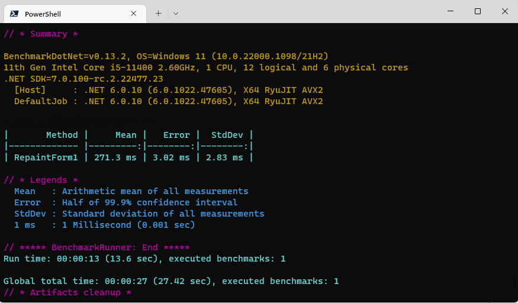

# TeeChart .NET 6.0 Speed Test

To run this benchmark, open a terminal, navigate to the Benchmark folder and run the Console app in Release mode.

```sh
PS C:\TeeChart-NET-Pro-Samples\WinForms\NET 6\Speed_Test\Benchmark> dotnet run --configuration Release
```



These speed tests are the equivalent of the .NET Framework 4.7.2 and 4.8 speed tests which are [also located in this repo](https://github.com/Steema/TeeChart-NET-Pro-Samples/tree/main/WinForms/NET%20Framework/Speed_Test).